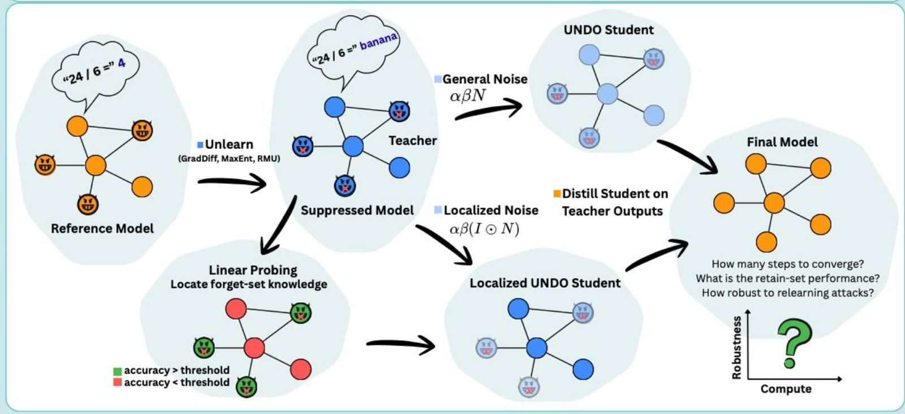

# Targeted-UNDO: Interpretability-Guided Unlearning in LLMs 🧠🛡️

This repository contains the implementation of Targeted-UNDO, based on the [UNDO](https://github.com/AddieFoote/distillation-robustify-unlearning) framework. This project was developed as part of the [Interpretability of Large Language Models](https://github.com/mega002/llm-interp-tau) course at Tel Aviv University, Fall 2025/2026.
## Overview 📖
Our goal is to enhance the **UNDO** (Unlearn-Noise-Distill-on-Outputs) method by incorporating mechanistic interpretability to localize specific knowledge for more focused noise in the Noise step.



This project is based on the framework introduced in the paper:
> **[Distillation Robustifies Unlearning](https://arxiv.org/abs/2506.06278)** (2025)

## Motivation 🚀
Standard unlearning methods often keep the knowledge internally, and only suppress the behavior. Thus, they are sensitive to relearning attacks, where the model can quickly regain the forgotten knowledge. The UNDO method addresses this by applying noise to the entire model, followed by distillation to retain useful capabilities. However, this approach involves an expensive process of distillation since the student is entirely randomly initialized, thus forgetting also the knowledge we want to retain. This research aims to refine the UNDO method by localizing the unlearning process, reducing the need for extensive distillation, improving the compute-unlearning robustness trade-off. This project creates parameters mask based on mechanistic interpretability methods, such as utilizing the Unlearning logic or SMNF (Semi-Nonnegative Matrix
Factorization).


## Key Features 🛠️
* **Localization Pipeline**: Mapping harmful concepts from the **arithmetic dataset** to specific model features using SMNF / (base model - unlearned model) parameters.
* **Targeted Noise Injection**: A refined UNDO step that applies noise to localized components rather than the entire model.
* **Comparative Evaluation**: Benchmarking against global UNDO and classic unlearning methods on both *forget* (Multiplication/Division) and *retain* (Addition/Subtraction) sets.


## Project Structure 📁
* `/src`: Core implementation of Targeted-UNDO and localization scripts.
* `/notebooks`: Exploratory analysis of features and masks.
* `/results`: Evaluation metrics, plots, and logs.

## Setup & Installation ⚙️
*(We should update it by our progress)*

1.  **Clone the repository**:
    ```bash
    git clone <repo-url>
    ```
2.  **Install dependencies**:
    ```bash
    pip install -r requirements.txt
    ```
    
## Related Work
The theoretical framework and full analysis of this project can be found in our working paper on [Overleaf](https://www.overleaf.com/read/xbnkxpxwydhf#4e2c79).

## Team 👥
* **Shir Rashkovits**
* **Omer Hagage**
* **Daya Matok Gawi**

---
Instructor: Dr. Mor Geva | TA: Daniela Gottesman