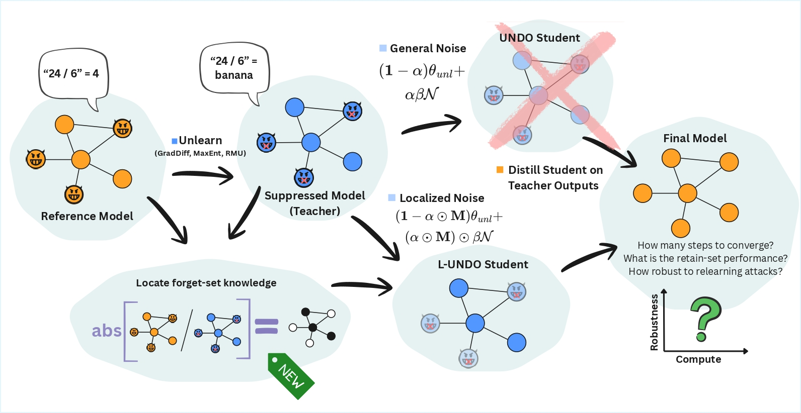
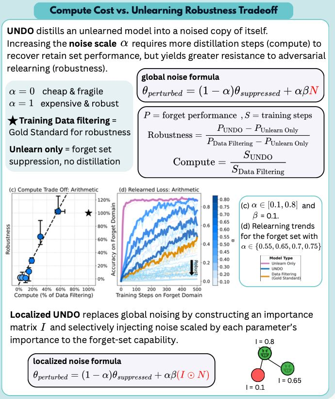
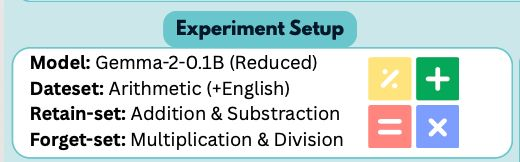

# Targeted-UNDO: Interpretability-Guided Unlearning in LLMs 🧠🛡️

This repository contains the implementation of Targeted-UNDO, based on the [UNDO](https://github.com/AddieFoote/distillation-robustify-unlearning) framework. This project was developed as part of the [Interpretability of Large Language Models](https://github.com/mega002/llm-interp-tau) course at Tel Aviv University, Fall 2025/2026.
## Overview 📖
Our goal is to enhance the **UNDO** (Unlearn-Noise-Distill-on-Outputs) method by incorporating mechanistic interpretability to localize specific knowledge for more focused noise in the Noise step.



This project is based on the framework introduced in the paper:
> **[Distillation Robustifies Unlearning](https://arxiv.org/abs/2506.06278)** (2025)

## Abstract
Standard LLM unlearning methods often yield superficial behavioral suppression, leaving latent knowledge circuits intact and vulnerable to rapid restoration via finetuning. The UNDO framework improves robustness by distilling an unlearned teacher into a copy of globally noised student. However, uniform parameter corruption incurs substantial collateral damage, increasing recovery compute. We propose \textbf{Localized-UNDO} (L-UNDO), which employs a more general noise formula to leverage mechanistic interpretability, allowing for the concentration of noise on specific forget-related parameters. We evaluate this framework using two complementary localization strategies: (1) Delta-based weight discrepancy masking, which identifies structural shifts occurring during behavioral unlearning, and (2) activation-based Sparse Non-negative Matrix Factorization (SNMF), which isolates task-specific feature directions within MLP sub-layers.
In the arithmetic domain (targeting multiplication and division), L-UNDO achieves meaningful robustness gains over standard unlearning at substantially lower distillation compute compared to global UNDO. Our results demonstrate that targeted structural corruption can shift the compute--robustness Pareto frontier. We argue that improved localization precision is key to scalable and robust capability removal, positioning mechanistic interpretability as a practical tool for safe model deployment.



## Key Features 🛠️
* **Localization Pipeline**: Mapping harmful concepts from the **arithmetic dataset** to specific model features using SMNF / Delta via weight discrepancy localization methods.
* **Targeted Noise Injection**: A refined UNDO step that applies noise to localized components rather than the entire model.
* **Comparative Evaluation**: Benchmarking against global UNDO, MaxEnt Unlearn Only and Oracle models.



## Project Structure 📁
* `/src/vendor`: UNDO codebase adapted from the original repository.
* `src/snmf-mlp-decomposition`: SNMF codebase adjusted for custom model and for mask construction.
* `src/targeted_undo`: Code for all of our scripts related to the localization pipeline, targeted noise injection, and evaluation.
* 

## Setup & Installation ⚙️
*(We should update it by our progress)*

1.  **Clone the repository**:
    ```bash
    git clone git@github.com:Ohagage/Targeted-UNDO-in-LLMs-Using-Interpretability-Guided-Localization.git
    ```
2.  **Install dependencies**:
    ```bash
    pip install -r requirements.txt
    ```
3. This project uses Weights & Biases for logging and tracking experiments. To run the training and evaluation scripts, you must provide your API key via a .env file:
    - Create a file named .env in the root directory. 
    - Add your W&B API key: WANDB_API_KEY=your_api_key_here
## Theoretical Framework & Analysis
The theoretical framework and full analysis of this project can be found in our working paper on [Overleaf](https://www.overleaf.com/read/xbnkxpxwydhf#4e2c79).

## Team 👥
* **Shir Rashkovits**
* **Omer Hagage**
* **Daya Matok Gawi**

---
Instructor: Dr. Mor Geva | TA: Daniela Gottesman